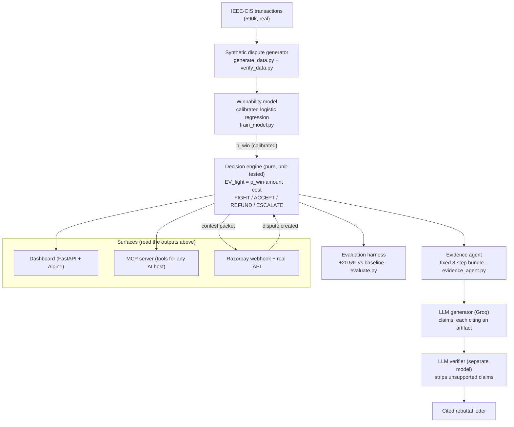

# RokdaDaav — *Fight Only When It Pays.*

An **AI risk manager for chargebacks**. When a customer disputes a card payment, a
merchant can contest it (a "representment") or accept the loss. Contesting costs a
fee plus staff time, so **fighting a case you will lose is negative expected value**.
RokdaDaav gathers evidence, predicts P(win) with a *calibrated* model, decides
**FIGHT / ACCEPT / REFUND / ESCALATE** with explicit rupee arithmetic, writes the
evidence-backed rebuttal letter, and proves on a held-out test set that its policy
recovers more money than the obvious rules.

> **Hackathon track:** AI Risk Manager. **Strictly defense-only** — nothing here
> generates consumer dispute claims; every letter cites only real, verified evidence.
> Full scope and schema in [`CLAUDE.md`](CLAUDE.md).

---

## The result (held-out test set, n = 566)

| policy | net recovery ₹ |
|---|---:|
| fight everything | 19,72,116 |
| fight nothing | 0 |
| fight if amount > ₹2,000 | 20,28,095 |
| fight if p_win > 0.5 | 18,15,433 |
| **RokdaDaav (EV + ratio + capacity)** | **24,44,442** |

**RokdaDaav beats the strongest simple baseline by +20.5%.** It also beats the best
*single* p_win threshold — because it ranks on **expected value (p_win × amount)**
under an analyst-hour budget, not on probability or amount alone. The split is
**temporal** (train on the past, test on the future) and the **false-positive cost**
(fought-and-lost = fee + analyst time) is priced into the numbers. Test calibration:
Brier 0.185, ECE 0.056 — a 0.7 really wins ~70% of the time, so it's safe to multiply
by rupees.

---

## How it works



A single dispute enters at the top and a **decision + a cited letter** come out the
bottom — every step deterministic and auditable except the two LLM calls, which are
themselves checked by a second model. The whole thing is **reproducible from one
seed**; the LLM responses are cached, so once warmed the demo needs no live call.

---

## What it does — feature map

**Core decisioning**
- **Winnability model** (`src/train_model.py`, `src/features.py`) — a calibrated
  logistic regression. We ship LR over LightGBM because the outcome DGP is an additive
  logit, so LR is correctly specified *and* better calibrated. Temporal test AUC ≈ 0.78.
- **Decision engine** (`src/decision_engine.py`) — pure rupee arithmetic, no ML/LLM/
  randomness, **17 unit tests**. Chooses the max-EV action, escalates the top 10% by
  `uncertainty × amount` to a human, then schedules FIGHTs under an analyst-hour budget
  with 48h deadline pre-emption.

**Evidence & letter** (`src/evidence_agent.py`, `src/llm_generator.py`, `src/llm_verifier.py`)
- A **fixed 8-step evidence agent** (deliberately *not* agentic) assembles a numbered
  bundle; every artifact has a resolvable `artifact_id`.
- The **generator** writes claims that each cite an artifact; a **separate verifier**
  strips any it can't support. Measured: 100% citation coverage, ~8% of claims
  stripped, 0% hallucination-under-stress, adversarial fabrications caught 5/5.

**Honest evaluation** (`src/evaluate.py`)
- Baseline table (above), precision/recall/F1 on the FIGHT decision, calibration
  (Brier/ECE + reliability diagram), segmented metrics, a **rupee confusion matrix**
  (prices false positives), and a net-recovery threshold sweep.

**Surfaces & agents**
- **Dashboard** (`app/`) — FastAPI + Alpine, no build step. Animates the 8-step agent,
  shows the rupee EV math, renders the letter with click-to-cite, and a dispute-ratio
  slider that surfaces the REFUND behaviour live.
- **Ask RokdaDaav** — an in-dashboard agent: a live Groq model *decides which tools to
  call* to answer a plain-English question.
- **MCP server** (`src/mcp_server.py`) — exposes the pipeline as Model-Context-Protocol
  tools so any AI host (Claude Desktop, Cursor, Claude Code) can consult it. Agency
  lives in the host; the auditable substance stays in RokdaDaav.
- **Razorpay integration** (`app/main.py`) — connects to a **real Razorpay test
  account**, auto-triages `dispute.created` webhook events, and writes a real,
  dashboard-visible order carrying the decision. (Dispute *events* are simulated
  because test mode doesn't emit them on demand — the connection and writes are real.)

**Fraud intelligence (AI)**
- **Abuse-ring detective** (`src/abuse_rings.py`) — clusters the dispute stream by
  shared signature (device fingerprint, card BIN, shipping city), flags coordinated
  friendly-fraud rings, and the AI narrates each with a defensive action. Reported on
  a known-answer eval: **precision 1.00, recall 0.79** (one stealth ring evades on
  purpose — stated openly).
- **What-if evidence advisor** — turns *predict* into *advise*: re-scores the model on
  counterfactual evidence to tell a merchant the cheapest document to gather to make a
  losing case winnable (e.g. *13% ACCEPT → add the consent record → 33%, flips to a
  +₹3,770 FIGHT*).

---

## The two ideas that make it distinct

1. **Sometimes refund a case you'd win.** A dispute counts toward the card network's
   monitoring ratio (e.g. Visa VAMP) even if you win the representment. Near the fine
   threshold, an immediate refund beats the recovery. Modelled as a `ratio_benefit`
   term — drag the dashboard slider to watch cases flip to REFUND.
2. **Agent-initiated disputes are their own class.** AI shopping agents buy
   autonomously; the buyer disputes to undo it. They authenticate correctly but look
   anomalous on device/IP, so a naive model calls them fraud. RokdaDaav models them as
   their own reason code with a distinct evidence signature.

---

## Run it

**Prerequisites:** Python 3.13; the two IEEE-CIS files at `data/raw/train_transaction.csv`
and `data/raw/train_identity.csv`; a `.env` with `GROQ_API_KEY` (and, for the live
Razorpay demo, `RAZORPAY_KEY_ID` / `RAZORPAY_KEY_SECRET`). `.env` is gitignored.

```bash
python -m venv .venv
.venv\Scripts\python.exe -m pip install -r requirements.txt   # Windows
# macOS/Linux: source .venv/bin/activate && pip install -r requirements.txt
```

Build the pipeline (in order — each step is a few seconds):

| # | command | produces |
|---|---|---|
| 1 | `python src/generate_data.py` | the synthetic dispute layer → `data/processed/*.parquet` |
| 2 | `python src/verify_data.py` | 8 sanity checks (leakage AUC, reason mix, censoring, agent signature) |
| 3 | `python src/train_model.py` | calibrated model + `predictions.parquet` + `reports/calibration.png` |
| 4 | `python src/evaluate.py` | the headline table + `reports/net_recovery_curve.png` |
| 5 | `python -m pytest tests/ -q` | 17 decision-engine unit tests |

Run the dashboard:

```bash
python app/main.py --warm      # one-time: warm the LLM cache for the demo cases
python app/main.py             # serve → http://127.0.0.1:8000
```

Run the MCP server (or wire it into a client via the committed `.mcp.json`):

```bash
python src/mcp_server.py       # stdio
```

Everything under `data/` and `reports/` is regenerable from the seed.

---

## Data

[IEEE-CIS Fraud Detection](https://www.kaggle.com/c/ieee-fraud-detection) — 590k card
transactions over a 182-day window (~24% carry an identity record). It is not
redistributed here (gitignored). **There is no public dataset of chargeback
outcomes**, so we generate a synthetic dispute layer on top and say so everywhere.

---

## Tech stack

Python 3.13 · pandas / numpy / scikit-learn / lightgbm · FastAPI + uvicorn · Alpine.js
(CDN, no build) · Groq (`openai/gpt-oss-120b` generator, `openai/gpt-oss-20b` verifier)
· MCP (`mcp` SDK) · Razorpay test API · matplotlib · pytest.

> **LLM provider note.** CLAUDE.md §11 specifies `claude-sonnet-4-6` via the Anthropic
> API; per the maintainer's direction this build uses **Groq**. Everything else in §11
> is preserved: two calls, an independent verifier, and every response cached to
> `data/llm_cache/` keyed by an input hash.

---

## Repo layout

```
config/            costs.yaml, generator.yaml, llm.yaml   (every constant lives here)
src/
  generate_data.py verify_data.py     # phase 1 — synthetic disputes + verifier
  features.py train_model.py          # phase 2 — calibrated winnability model
  decision_engine.py                  # phase 3 — pure rupee EV (unit-tested)
  evidence_agent.py llm_generator.py llm_verifier.py llm_demo.py   # phase 4 — letter
  evaluate.py                         # phase 5 — honest metrics
  mcp_server.py                       # MCP tools
  abuse_rings.py                      # abuse-ring detective
app/               main.py, static/index.html    # dashboard + Razorpay + agents
tests/             test_decision_engine.py       # 17 tests
data/raw/          IEEE-CIS input        (gitignored)
data/processed/    generated parquet     (gitignored)
data/llm_cache/    cached LLM responses  (gitignored)
reports/           calibration + net-recovery plots
CLAUDE.md          project contract — scope, schema, constraints
```

---

## Design notes (the ML rigor)

- **Correctly-specified model.** The generator makes outcomes an additive logit over
  observable evidence + an *unobserved* issuer-leniency term + Gaussian noise. So we
  ship calibrated logistic regression (it beat LightGBM on AUC *and* calibration), and
  the noise/unobserved term cap achievable AUC on purpose (target 0.72–0.80; got 0.78).
- **Full-window temporal split, on `filed_dt`.** We decide when a dispute is *filed*,
  so the split is on filing date, not transaction date. Disputes filed past the
  observation window are dropped (right-censored), never clipped.
- **Jensen-corrected base rates.** Each reason code's intercept is solved so the
  *realised* mean win rate matches the target given the evidence spread.
- **Three-state `device_match_status`** (`matched`/`mismatched`/`unknown`) — `unknown`
  = no identity record (75% of data); a boolean would encode missingness, not signal.

---

## Honest limitations (stated, not hidden)

- **Synthetic dispute layer.** No public chargeback-outcome data exists; the impressive
  result is "our policy beats simple baselines *on our simulated world*", with real
  rigor (temporal split, calibration, false-positive cost). The data is modeled.
- **182 days is short** to claim resistance to long-run drift; the split guards against
  look-ahead leakage only.
- **Censored labels.** In production you observe outcomes only for *fought* cases, so
  training data is biased; correcting it needs a randomized holdout. A naive `fought`
  column is included to make this discussable.
- **Razorpay events are simulated** (test mode emits no disputes on demand); the API
  connection, signature verification, and order writes are real.
- **Cost constants are vendor-directional** (Chargebacks911), stated in `config/costs.yaml`.
- **Strictly defense-only.** Nothing generates disputes; the letter cannot fabricate.
